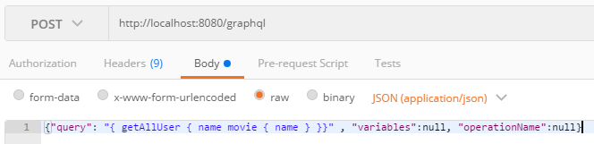
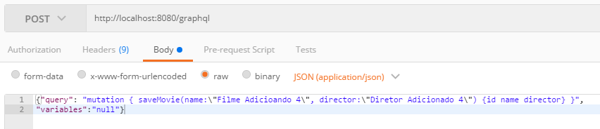

# API GraphQL com SpringBoot + SpringData + Flyway (PostgreSQL 10.3)
Aplicação que cria uma API GraphQL juntamente com SpringBoot + SpringData + Flyway + PostgreSQL.
O conceito e dicas sobre API GraphQL pode ser encontrado na página oficial: https://graphql.org/learn/

## Ações necessárias para utilização
Para rodar a aplicação da maneira como ela já está configurada, basta criar um banco de dados com o nome 'mygraphql_db' em seu PostgreSQL na porta padrão 5432. O usuário e senha do banco devem ser 'postgres'.

Caso queira realizar modificações quanto ao:
 - Tipo de banco utilizado;
 - Porta;
 - Nome do banco de dados;
 - Usuário e senha.

Basta modificar o arquivo de propriedades da aplicação, localizado em '/resource/application.properties'.

# Testando a API Graph
Ao executar a aplicação, dois endpoints ficarão automaticamente disponíveis. São eles o "/graphql" e o "/graphiql". 

/graphql: Endpoint responsável por realizar as ações, ou seja, em testes fora do "/graphiql" (que será explicado logo abaixo) ou em alguma aplicação que esteja consumindo esta API, este endpoint que deverá ser usado para realizar as requisições.

/graphiql: Nos disponibilizará a interface gráfica GraphiQL, onde poderemos ter acesso a documentação de nossa API e também realizar Queries e Mutations de forma mais elegante, sem precisarmos recorrer a ferramentas mais verbosas para testar este tipo de API, como o Postman. Por baixo dos panos as Queries e Mutations realizadas dentro desta ferramenta, serão encaminhadas para o endpoint "/graphql".

## Testes através do GraphiQL (interface gráfica do GraphQL)
Exemplo de realização de uma Query (exemplo funcionando, baseado nos dados desta aplicação) que retorna todos os usuários do banco, trazendo o nome/idade de cada um, juntamente do nome do filme favorito dos mesmos:
```js
{
  getAllUser { 
    name 
    movie {
      name
    }
  }
}
```

Exemplo de realização de uma Mutation (exemplo funcionando, baseado nos dados desta aplicação) que cria um filme (com os dados do nome e diretor) no banco e retorna como resposta o objeto filme criado com os campos 'id, name e director' preenchidos:
```js
mutation {
  saveMovie(name: "Filme Teste 6", director: "Diretor Teste 6") {
    id
    name
    director
  }
}
```

## Testes através do Postman
Embora o Postman não seja a ferramenta ideal para testes de API GraphQL, muita gente o usa por causa das API Rest. Por este motivo, deixarei aqui a sintaxe para realizar testes usando-o. Mas recomendo fortemente, caso você queira usar uma ferramente a parte para testes, a utilização do Insomnia (https://insomnia.rest/), pois ele já possui uma forma específica para trabalhar com API GraphQL (https://support.insomnia.rest/article/61-graphql).

Exemplo de realização de uma Query no Postman (exemplo funcionando, baseado nos dados desta aplicação):



Exemplo de realização de uma Mutation no Postman (exemplo funcionando, baseado nos dados desta aplicação):



# Carregando dados do banco de maneira eficiente com GraphQL e Spring Data
Caso esteja usando spring data, igual a este projeto, é importante que as relações entre as entidades sejam, na maior parte das vezes, configuradas no modo "preguiçoso" para que você usuflua corretamente dos benefícios do GraphQL. Assim, caso o consumidor de sua API GraphQL informe que precisa apenas dos dados de uma determinada entidade, seu backend não precisa realizar ações extras desnecessárias no banco para carregador dados de objetos que são atributos da entidade que era realmente desejada.
No exemplo deste projeto, a classe "Movie" é um atributo da classe "User". Sendo assim, caso o consumidor da mesma queira apenas o nome de um determinado "User", o backend não irá realizar um JOIN de "Movie" no momento de buscar as informações de "User".
Exemplo de configuração da entidade usando Spring Data (exemplo funcionando, baseado nos dados desta aplicação):

```java
    @ManyToOne(fetch = FetchType.LAZY)
    @JoinColumn(name = "movie_id", nullable = false, updatable = false)
    private Movie movie;
```
Isso faz com que o "User" instancie um objeto "Movie" e preencha apenas o atributo de "ID" do filme, pois o "ID" já está presente na tabela de "User" no momento da busca.
Mas e quando o consumidor quiser dados de "Movie", como o nome do filme ou o diretor? Nesse momento as classes Resolvers são chamadas, para "resolver" as lacunas dos objetos, que em tese (caso você tenha configurado o carregamento "preguiçoso corretamente", existirão.